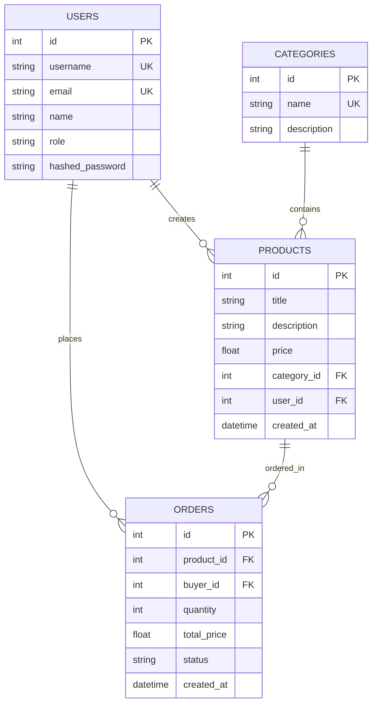

# MiniHub Database ER Diagram (Mermaid)

## Entity Relationship Diagram

## How to View This Diagram

1. **On GitHub:** This diagram will render automatically when you view this file on GitHub
2. **VS Code:** Install the "Markdown Preview Mermaid Support" extension
3. **Online:** Copy the mermaid code to https://mermaid.live/

## Relationship Descriptions

- **USERS creates PRODUCTS**: One seller can create multiple products (1:N)
- **USERS places ORDERS**: One buyer can place multiple orders (1:N)
- **CATEGORIES contains PRODUCTS**: One category can have multiple products (1:N)
- **PRODUCTS ordered_in ORDERS**: One product can be in multiple orders (1:N)
